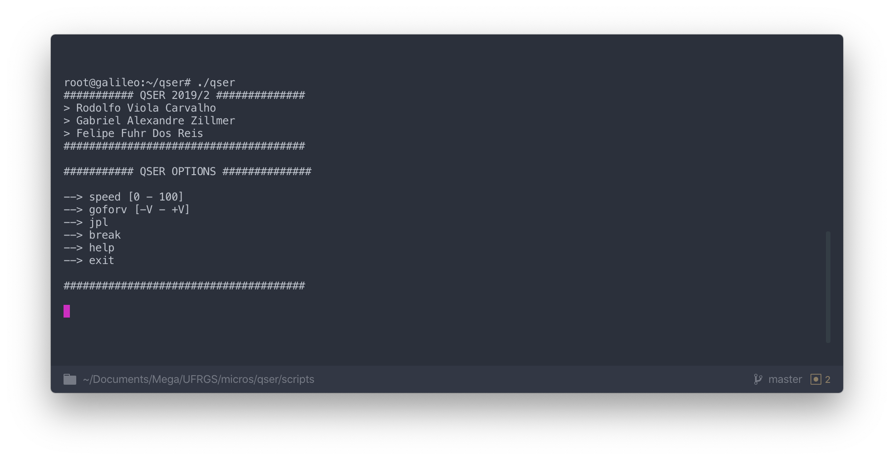

# QSER

QSER is a application and hardware shield interface to manage and fully control a engine motor (Quanser Robots) on Galileo v2 shield.
On this repository you will find the shield hardware design under `/shield` and the software resources under `/src`.



## Build

### Project Local 
This project is using cmake to automate build releases and versioning.
- Compile the full project with `/cmake-build-release/make`.
- Clean built files with `/cmake-build-release/make clean`.

### Project Target Galileo
- Compile the full project with `make`.
- Clean built files with `make clean`.

### Documentation
Compile the project documentation to `docs/` folder.
```
  $ make docs
```


## Modules

#### Debugger:
This project contain a built in debugger for handling execution path helping the developers find out eventual bugs or errors.
To enable this feature you need to enable the debugger options under `/src/helpers/helpers.h`.

#### Run Local:
This project contain a local template simulation to help developers simulate the code that will run on the Galileo shield, this feature enable developers to build and run the code without the physical shield device. 
To enable this feature you need to enable the Run Local option under `/src/helpers/helpers.h`.

## Roadmap

See the [open issues](https://github.com/rodolfoviolac/qser/issues) for a list of proposed features (and known issues).

## Contributing

For major changes, please open an issue first to discuss what you would like to change.
Please make sure to update tests as appropriate.

1. Fork the Project
2. Create your Feature Branch (`git checkout -b feature/AmazingFeature`)
3. Commit your Changes (`git commit -m 'Add some AmazingFeature'`)
4. Push to the Branch (`git push origin feature/AmazingFeature`)
5. Open a Pull Request

## Team

> Or Contributors

| <a href="https://github.com/rodolfoviolac" target="_blank">**Rodolfo Viola**</a> | <a href="https://github.com/gazillmer" target="_blank">**Gabriel Zillmer**</a> | <a href="https://github.com/felipefuhr" target="_blank">**Felipe Fuhr**</a> |
| :---: |:---:| :---:|
| [](https://github.com/rodolfoviolac)    | [](https://github.com/gazillmer) | [](https://github.com/felipefuhr)  |
| <a href="https://github.com/rodolfoviolac" target="_blank">`github.com/rodolfoviolac`</a> | <a href="https://github.com/gazillmer" target="_blank">`github.com/gazillmer`</a> | <a href="https://github.com/felipefuhr" target="_blank">`github.com/felipefuhr`</a> |


## License
[MIT](https://github.com/rodolfoviolac/qser/LICENSE.md)

Project Link: [https://github.com/rodolfoviolac/qser](https://github.com/rodolfoviolac/qser)